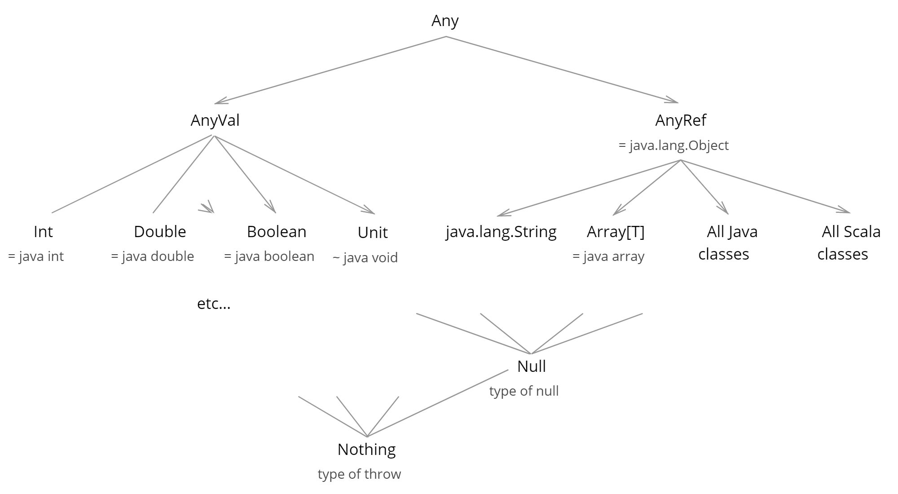
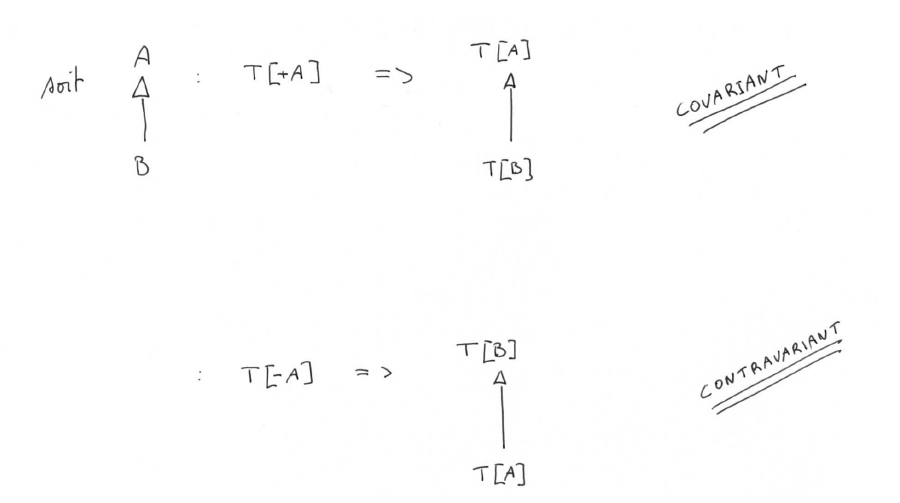

[TOC]

## Expression, Types and Values (ch 2)

### Methods versus fields

The difference is subtle - a field gives a name to a value, whereas a method gives a name to a computation that produces a value.

```scala
object Test7 {
   val simpleField = {
     println("Evaluating simpleField")           // print only at the first call
     42
   }
   def noParameterMethod = {
     println("Evaluating noParameterMethod")     // print at each call
     42
   }
}
```

- The body expression **of a field** is ***run only once*** after which the final value **is stored in the object**. The expression is never evaluated again.


- The body **of a method**, on the other hand, **is evaluated every time we call the method**.

  ​

##  Objects et Classes (ch 3)

### classes

#### Defining a class

A class declaration binds a name (for example `Person`) and **is not an expression**. However, unlike an object name, **we cannot use a class name in an expression**. 
A class is not a value, and there is a different *namespace* in which classes live.

#### Constructor

TODO

#### Default and Keyword Parameters

All Scala methods and constructors support ***keyword parameters*** and ***default parameter values***.

When we call a method or constructor, we can *use parameter names as **keywords*** to specify the parameters **in an arbitrary order**. *

*This comes in doubly useful when used in combination with default parameter values*, defined like this:

```
def greet(firstName: String = "Some", lastName: String = "Body") =
  "Greetings, " + firstName + " " + lastName + "!"

```

If a parameter **has a default value we can omit it in the method** call:

```
greet("Busy")

```

Combining keywords with default parameter values let us skip earlier parameters and just provide values for later ones:

```
greet(lastName = "Dave")
```


#### Scala type hierarchy



There are **two special types** at the ***bottom*** of the hierarchy:

-  `Nothing` is the type of `throw` expressions, and 


- `Null` is the type of the value `null`. 

These special types are subtypes of everything else, which helps us **assign types to `throw` and `null`** while **keeping other types in our code sane**. 

The following code illustrates this:

```scala
def badness = throw new Exception("Error")
// badness: Nothing

null
// res: Null = null

val bar = if(true) 123 else badness
// bar: Int = 123

val baz = if(false) "it worked" else null
// res: String = null
```

Although the types of `badness` and `res` are `Nothing` and `Null` respectively, **the types of `bar` and `baz` are still sensible**. This is because **`Int` is the least common supertype of `Int` and `Nothing`**, and **`String` is the least common supertype of `String` and `Null`**.


### Objects as Functions

#### The apply method

In Scala, by convention, an object can be "called" like a function **if it has a method called `apply`.** Naming a method `apply`affords us a special shortened call syntax:	`foo.apply(args)` becomes `foo(args)`.


### Case classes (et Case objects)

TODO

#### Case objects

If you define **a case class with no constructor arguments** => define a ***case object***. 
It has the same default methods as a case class.

```scala
case object Citizen {
  def firstName = "John"
  def lastName  = "Doe"
  def name = firstName + " " + lastName
}
```

The `case object` keyword defines **a class and an object**:

```scala
class Citizen { /* ... */ }
object Citizen extends Citizen { /* ... */ }
```

### Pattern matching

syntaxe:

```scala
expr0 match {
  case pattern1 => expr1
  case pattern2 => expr2
  ...
}
```


## Traits (ch 4)

Utiliser des ***def*** dans les traits.
Les implémentations concretes peuvent utiliser soit des ***def*** ou des ***vals***.

### Modelling Data with Traits

#### Algebraic Data Types

An algebraic data type is any data that uses the above two patterns. In the functional programming literature, data using:

-  the "**has-a and**" pattern is known as a ***product type***, and 


- the "**is-a or**" pattern is a ***sum type***.

  ​

####  Product Type pattern

`A`  ***has*** a `B` ***and*** `C`

```scala
trait A {
  def b: B
  def c: C
}
```
or
```scala
case class A(b: B, c: C)
```


#### Sum Type pattern

`A` ***is*** a `B` ***or*** `C`

```scala
sealed trait A
final case class B() extends A
final case class C() extends A
```


#### The Missing Patterns

##### is-a and

```scala
trait B
trait C
trait A extends B with C
```


##### has-a or

The "has-a or" patterns means that `A` has a `B` or `C`. **There are two ways** we can implement this. 

We can say that `A` has a `d`of type `D`, where `D` is a `B` or `C`. We can mechanically apply our two patterns to implement this:

```scala
trait A {
  def d: D
}

sealed trait D
final case class B() extends D
final case class C() extends D
```


Alternatively we could implement this as `A` is a `D` or `E`, and `D` has a `B` and `E` has a `C`. Again this translates directly into code

```
sealed trait A
final case class D(b: B) extends A
final case class E(c: C) extends A
```


### Working with data

#### structural-recursion

Structural-recursion answers the question: "How can we do **different things** for **different data types** that belong to a **common trait**?"

#### Structural Recursion using Polymorphism

it's just the well known ***overriding*** of **POO**:

```scala
sealed trait A {
  def foo: String
}
final case class B() extends A {
  def foo: String = "It's B!"
}
final case class C() extends A {
  def foo: String = "It's C!"
}
```

If we define **an implementation in a trait**, and change the implementation in an extending class, we must use the **`override`keyword.**

```scala
sealed trait A {
  def foo: String = "It's A!"
}
final case class B() extends A {
  override def foo: String = "It's B!"
}
final case class C() extends A {
  override def foo: String = "It's C!"
}
```


#### Structural Recursion using Pattern Matching

 Define a **case** for **every subtype**, and each pattern matching case **must extract the fields we're interested in**:

```scala
def f(a: A): F = a match {
    case A(b, c) => ??? //use b and c
    case B(_, c) => ??? //use only c
  }
```

Note how we access the **inner parts of A**. Structural recursion is essentially the process of breaking down data into smaller pieces

##### Where to implement pattern matching

<u>2 possibilities :</u> 

1. pattern matching **in** a method of **the base trait** 

2. pattern matching **in** a method of an **external object**

   ​

<u>The general rule is:</u>

-  if a method only depends on other fields and methods **the base trait** it is a good candidate to be implemented **inside the trait**. 


- If the method depends on other **data outside of the trait**, consider implementing it using pattern matching **in an external object** . 

- If we want to have **more than one implementation** we should use pattern matching and implement it **in  external(s) object(s).**

  ​

#### Object-Oriented vs Functional Extensibility

TODO


### Recursive Data

A particular use of algebraic data types that comes up very often is defining *recursive data*. This is data that is defined in terms of itself, and allows us to create data of potentially unbounded size (though any concrete instance will be finite).

#### Recursive Algebraic Data Types Pattern

<u>When defining</u> recursive algebraic data types, **there must be at least two cases**: 

- one **that is recursive**, and 


- one **that is not**. Cases that are not recursive are known as **base cases**. 

In code, the general skeleton is:

```
sealed trait RecursiveExample
final case class RecursiveCase(recursion: RecursiveExample) extends RecursiveExample
final case object BaseCase extends RecursiveExample

```


<u>When writing structurally recursive code</u> on a recursive algebraic data type:

- whenever we encounter **a recursive element** in the data  => we **make a recursive call to our method**.

- whenever we encounter **a base case** in the data =>  we return **the identity for the operation we are performing.**

  ​


#### Tail Recursion

##### An easy mistake about tail recursion

```scala
def sum(list: IntList): Int = list match {
    case End => 0
    case Pair(hd, tl) => hd + sum(tl)
  }
```

**Isn’t the "last action" `sum(tl)`  a call to itself, making it tail-recursive?**

Although sum(tl) is at the end of the second case expression, the **last two actions of this function are**:

1. Call `sum(tl)`

2. When that function call returns, add its value to `hd` and return that result

When we make that code more explicit and write it as a series of one-line statements: 

```scala
val s = sum(tl)
val result = hd + s
return result
```

the last calculation that happens before the return statement is the **sum of `hd` and `s`** is calculated and **not the recursive call**.


##### @tailrec annotation

One way **to be certain that a  function is tail recursive** is to annotate it with the **@tailrec** annotation to **ask the compiler** to check that methods we believe are tail recursion **really are**.


##### So, how do I write a tail-recursive function?

Now that you know the current approach isn’t tail-recursive, the question becomes, “How do I make it tail-recursive?” A common pattern used to make a recursive function that “accumulates a result”
into a tail-recursive function is to follow a series of simple steps:

1. Keep the original function signature the same (i.e., sum’s signature).
2. Create a second function by 
  1. copying the original function 
  2. giving it a new name 
  3. making it private 
  4. giving it a new “accumulator” input parameter
  5. adding the @tailrec annotation to it.
3. Modify the second function’s algorithm so it uses the new accumulator
4. Call the second function from inside the first function. When you do this you give the second function’s accumulator parameter an “seed” value which correspond to the identity value of the function.

```scala
@tailrec
def sum(list: IntList): Int = {
    @tailrec
    def sumWithAccumulator(list: IntList, total: Int = 0): Int =
      list match {
        case End => total
        case Pair(hd, tl) => sum(tl, total + hd)
    }
    sumWithAccumulator(list, 0) // '0' is the identity of 'sum' function
}
  
```


##### Remark on tail recursion

In Scala we tend **not to work directly with tail recursive** functions as there is a **rich collections library that covers the most common cases where tail recursion is used**. 
Should you need to go beyond this, because you're implementing your own datatypes or are optimising code, it is useful to know about tail recursion.


## Sequencing computation (ch 5)

### Generics

Generic types allow us to ***abstract over types***.

When we call a method or construct a class with a type parameter, **the type parameter is bound to the concrete type** within the method or class body.


#### Type Parameter Syntax

Generic types can be declared in a class or trait declaration in which case they are **visible throughout the rest of the declaration**.

```scala
case class Name[A](...){ ... }
trait Name[A]{ ... }
```

Alternatively they may be declared in a method declaration, in which case they are **only visible within the method**.

```scala
def name[A](...){ ... }
```

#### Generic Algebraic Data Types

>  If `A` of type `T` is a `B` or `C` write
>
> ```scala
> sealed trait A[T]
> final case class B[T]() extends A[T]
> final case class C[T]() extends A[T]
> ```
>
> 

### Generic Folds for Generic Data

#### Working With Functions

##### Placeholder syntax

```scala
_ + _     // expands to `(a, b) => a + b`
foo(_)    // expands to `(a) => foo(a)`
foo(_, b) // expands to `(a) => foo(a, b)`
_(foo)    // expands to `(a) => a(foo)`
// and so on..
```

Placeholder syntax can be confusing for large expressions and **should only be used for very small functions**.

##### Converting methods to functions

convert method calls to functions by follow a method name with an underscore 

```scala
object Sum {
  def sum(x: Int, y: Int) = x + y
}

Sum.sum  // method call without parameters => ERROR

(Sum.sum _) // res: (Int, Int) => Int
```

In situations where Scala can infer that we need a function, we can even drop the underscore and simply write the method name---the compiler will promote the method to a function automatically.

### Variance

*variance annotations* allow us to **control subclass relationships between types** with **type parameters**.

#### Invariance, Covariance, and Contravariance

A type `Foo[T]` is ***invariant*** in terms of `T`, meaning that the types `Foo[A]` and `Foo[B]` are unrelated regardless of the relationship between `A` and `B`. This is the **default variance** of any generic type in Scala.

A type `Foo[+T]` is ***covariant*** in terms of `T`, meaning that **`Foo[A]` is a supertype of `Foo[B]`** if **`A` is a supertype of `B`**.

A type `Foo[-T]` is ***contravariant*** in terms of `T`, meaning that **`Foo[A]` is a *subtype* of `Foo[B]`** if `A` is a *supertype* of `B`. 



<u>**IMPORTANT**:</u> 

- **covariance** is the **"classical" case of variance** (type with types parameters, collection ... ). Tt' is the most easy to undersand too.


- the **only example of contravariance** that I am aware of is **function arguments**.


#### Function Types pattern

> **<u>Functions are :</u>**
>
> - **contravariant** in terms of their **arguments** 
> - **covariant** in terms of their **return type**.
>
> ```
> def func[-A, +B](in: A): B = ...
>
> ```
>
> 

#### Covariant Generic Sum Type Pattern

> If `A` of type `T` is a `B` or `C`, and `C` **is not generic**, write
>
> ```
> sealed trait A[+T]
> final case class B[T](t: T) extends A[T]
> case object C extends A[Nothing]
>
> ```
>
> This pattern extends to more than one type parameter. If a type parameter is not needed for a specific case of a sum type, we can substitute `Nothing` for that parameter.


#### Contravariant Position Pattern

There is another pattern we need to learn for **covariant sum types**, which involves the **interaction of covariant type parameters** and **contravariant method and function parameters**.

> If `A` of a covariant type `T` and a method `f` of `A` **complains that `T` is used in a contravariant position**, introduce a type `TT >: T` in `f`.
>
> ```
> case class A[+T]() {
>   def f[TT >: T](t: TT): A[TT] = ???
> }
>
> ```


#### Type Bounds

Type bounds extend to specify subtypes as well as supertypes: 

 **`A <: Type`** declares that  `A` must be a **subtype** of `Type` .

 **`A >: Type `** declares that `A` must be a **supertype**  of `Type`.